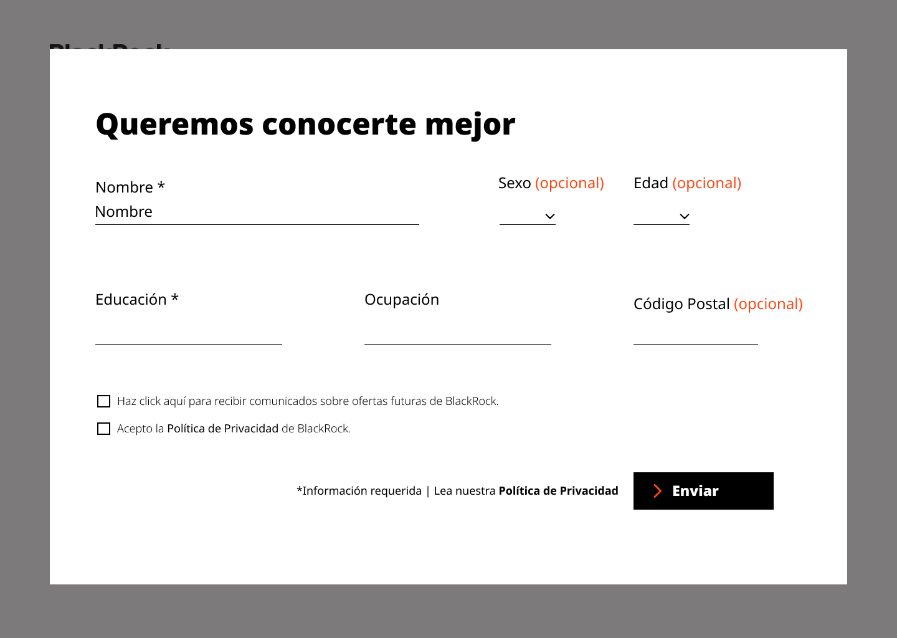

# RetoBLK2022
# Creando una Red Social - RED SOCIAL NOVA

## Índice

* [1. Resumen del proyecto](#1-resumen-del-proyecto)
* [2. Historias de usuario](#2-historias-de-usuario)
* [3. Prototipos de alta fidelidad](#4-Prototipo de alta-fidelidad)
* [4. Manual de usuario](#5-guía de usabilidad)
* [5. Tecnologías utilizadas](#6-tecnologías-utilizadas)
* [6. Cocreadoras](#7-cocreadoras)

## 1. Resumen del proyecto:
Desarrollo de una plataforma de educación financiera para clientes retail de Citibanamex para obtener datos demográficos sobre nuestras inversionistas y crear un plan de aprendizaje personalizada. Creamos el plan de aprendizaje a través de una prueba de perfilamiento del cliente para entender su demográfica y nivel de educación financiera actual. La plataforma y la prueba deben de estar muy user-friendly, y animar a los clientes para tomar la prueba/completar su plan de aprendizaje. 

### Contexto: 
Queremos entender mejor nuestras clientes a través de los datos de la prueba, y también cumplir con nuestro objetivo para educarles sobre temas de inversiones, diversificación, y la oferta de producto de BlackRock. 

###Problemática: 
Actualmente nuestros clientes no están aprovechando nuestros recursos de educación financiera en nuestra página web de BlackRock, así queremos animar a los clientes para tomar una prueba y empezar los mini-cursos de educación. Debemos tener una plataforma muy interactiva, y una prueba estilo “Buzzfeed”. 

(#2-historias-de-usuario)
###Historia de Usuario 1 Página de inicio.
YO COMO usuario QUIERO entrar a una página llamativa que me invite a conocer más sobre educación financiera PARA atreverme a invertir.

###Historia de Usuario 2 Quizz de educación financiera.
YO COMO usuario QUIERO tomar el test de educación financiera PARA conocer mi nivel de conocimientos.

###Historia de Usuario 3.Resultados del Quizz y cursos recomendados.
YO COMO usuario QUIERO acceder a los cursos que se acomodan mejor a mi nivel PARA continuar mi preparación en materia financiera.

###Historia de Usuario 4. Creación de cuenta en la plataforma.
YO COMO usuario QUIERO registrarme en la plataforma de BlackRock PARA comenzar los cursos que me recomendaron

###Historia de Usuario 5. Página de Perfil.
YO COMO usuario QUIERO tener una página de perfil PARA poder visualizar mi progreso en la ruta de aprendizaje y acceder rápidamente a mis cursos

###Historia de Usuario 6. Página de cursos recomendados.
YO COMO usuario QUIERO acceder a una vista de los cursos que me recomiendan PARA elegir alguno y comenzar mi aprendizaje

Para descubir las principales necesidades de nuestros usuarios, realizamos una investigación donde delimitamos los puntos más importantes:
- Los usuarios prefieren no proporcionar datos personales desde el inicio de la prueba. 
- Los usuarios encuentran más pedagógico una prueba interactiva con temática financiera.
- Los desean ver su progreso en un perfil gamificado.
- Los usuarios se identifican más fácilmente con una jerarquía con alguna temática popular.
- Los usuarios desean registrarse con una cuenta de correo google.

## 4. Prototipos de alta fidelidad

Acceso al prototipo en [Figma](https://www.figma.com/file/WuY6svf3tpRThbA9UF7TjM/Reto-BLK?node-id=195%3A62)

## 6. Tecnologías utilizadas
- Angular
- TypeScript
- HTML
- Sass
- Vanilla JS
- Firebase y Firestore
- Figma 
- Fake Api
- Heroku
- Angular Material 
- Font Awesome
- JSPDF

## 7. Cocreadoras
 - [Angélica Venta](https://github.com/AngieVenta)
 - [Anita Aguilar](https://github.com/annamar26)
 - [Belem Hernández](https://github.com/belemHA)
 - [Colette Ordoñez](https://github.com/ColetteOrdz)
 - [Daniela Torrel](https://github.com/danitorrel)
 
